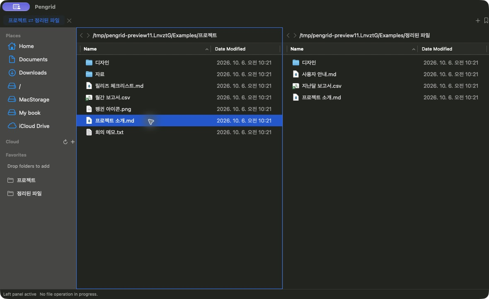
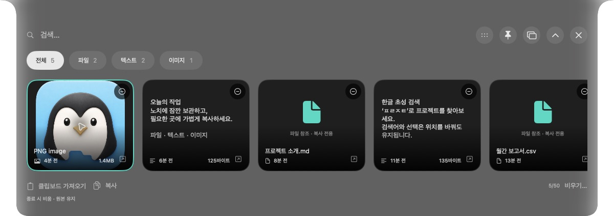
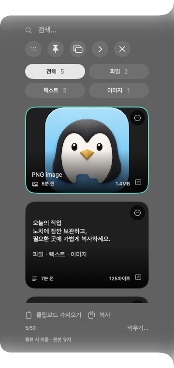
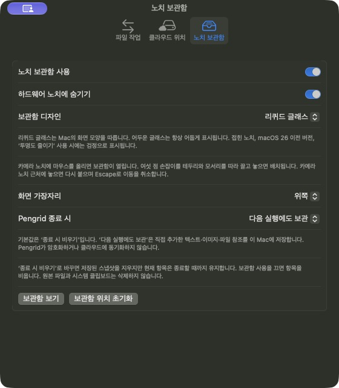

<p align="center">
  
</p>

<h1 align="center">Pengrid</h1>

<p align="center">
  <strong>파일은 나란히. 아이디어는 노치에 가까이.</strong><br>
  움직이는 노치 보관함을 갖춘 무료 macOS 파일 관리자입니다.<br><br>
  <a href="https://github.com/pmh10401/Pengrid/releases/tag/v1.3.0"><strong>Mac용 다운로드</strong></a>
  · <a href="README.md">English</a>
  · <a href="docs/user-guide.ko.md">상세 기능 안내</a>
</p>



*실제 Pengrid 화면 구성 요소를 예시 데이터로 실행해 촬영했습니다. 개인 파일과 클라우드 계정은 포함하지 않았습니다.*

## 다운로드

[**Pengrid 1.3.0 — DMG 다운로드**](https://github.com/pmh10401/Pengrid/releases/download/v1.3.0/Pengrid.dmg)

**Apple Silicon · macOS 15 이상 · 버전 1.3.0, 빌드 14 · 무료 · GitHub 정식 릴리스**

DMG를 열고 `Pengrid.app`을 `Applications` 폴더로 옮기세요.
같은 릴리즈의 [SHA256SUMS.txt](https://github.com/pmh10401/Pengrid/releases/download/v1.3.0/SHA256SUMS.txt)를
받아 다운로드한 파일을 확인할 수 있습니다.

```bash
shasum -a 256 -c SHA256SUMS.txt
```

> 이 릴리스는 ad-hoc 서명이며 Developer ID 서명과 Apple 공증을
> 받지 않았습니다. Gatekeeper가 실행을 차단할 수 있습니다. 이 저장소의
> 릴리즈 페이지에서 내려받으세요. Pengrid는 macOS 보안 기능을 끄도록 요구하지 않습니다.

[릴리즈 노트](docs/release-notes-v1.3.0.md) ·
[패키징·검증 안내](docs/release.ko.md)

## 화면 가장자리에 붙는 나만의 보관함

곧 사용할 파일, 유용한 메모, 이미지를 노치에 잠깐 보관하세요.
**설정 > 노치 보관함 > 노치 보관함 사용**을 켜고 항목을 끌어 넣거나
**클립보드 가져오기**를 누르면 됩니다. 클립보드는 직접 가져올 때만 읽습니다.



카메라 노치가 있는 MacBook에서는 접힌 보관함이 노치 안에 숨겨집니다.
마우스를 올리면 펼쳐지고, 벗어나면 잠깐 기다린 뒤 접힙니다. 클릭하면
열린 상태를 유지합니다. 여섯 점 손잡이를 화면 테두리를 따라 옮기면 모서리를
부드럽게 돌아가고, 놓은 가장자리에 붙어 화면 안쪽으로 펼쳐집니다.
카메라 노치 근처에 놓으면 다시 붙으며 **Escape**로 이동을 취소할 수 있습니다.

<table>
  <tr>
    <td align="center" width="46%">
      
    </td>
    <td align="center" width="54%">
      
    </td>
  </tr>
  <tr>
    <td>왼쪽·오른쪽에서는 카드를 세로로 배치합니다.</td>
    <td>리퀴드 글래스·어두운 글래스·검정을 선택하세요.</td>
  </tr>
</table>

- **한글 초성으로 검색:** 파일 이름, 메모와 이미지 이름을 검색합니다.
  전체·파일·텍스트·이미지 분류에 실제 항목 개수가 표시됩니다.
- **위치를 바꿔도 이어서 작업:** 검색어·분류·선택 항목을 유지합니다.
  카드를 스크롤해도 검색창과 클립보드 버튼은 고정됩니다.
- **키보드로 선택과 복사:** 가로형은 **← / →**, 세로형은 **↑ / ↓**로
  선택하고 **⌘C**로 복사합니다. 검색창 안의 방향키는 텍스트를 편집합니다.
- **파일 작업 진행률 확인:** 실행 중 작업, 대기열과 복구·실패 상태가 있을 때
  기존 작업 센터의 진행 상황을 보여 줍니다.
- **보관 정책 선택:** **종료 시 비우기**가 기본입니다.
  **다음 실행에도 보관**을 선택하면 암호화되지 않은 로컬 스냅샷을 저장합니다.
  보관함에서 제거해도 원본 파일은 유지됩니다.

리퀴드 글래스는 **macOS 26 이상**에서 사용할 수 있습니다. 이전 macOS 또는
**투명도 줄이기** 사용 시에는 검정으로 표시합니다. **동작 줄이기**는
애니메이션을 생략합니다. 앱 메뉴, 파일 우클릭 메뉴, 보관함과 보관함 설정은
한국어·영어를 지원하며 일부 대화상자와 오류 메시지는 영어로 표시됩니다.

최대 **50개 항목**, 텍스트 항목당 **256 KiB**, 정적 PNG/TIFF 이미지당
**16 MiB·4천만 픽셀**, 전체 인코딩 데이터 **64 MiB**를 지원합니다.
파일은 참조로 보관합니다. 자동 클립보드 수집, OCR, 보관함 클라우드 동기화와
전역 단축키는 제공하지 않습니다. [보관함 상세 동작](docs/user-guide.ko.md#top-shelf-보관함)

## 파일 관리에 필요한 기능을 한곳에

| 작업 | Pengrid가 제공하는 기능 |
| --- | --- |
| **두 패널과 여러 작업공간** | 독립된 기록·필터·정렬, 탭, 이름 있는 프로필, 세션 배치 복원과 닫은 탭 다시 열기 |
| **파일 찾기** | 이름·경로 재귀 검색, 한글 초성, 유형·확장자·크기·수정일 필터, 저장된 검색과 선택적 Spotlight 색인 내용 검색 |
| **바로 미리보기** | **Space**로 폴더 바로 아래 내용 또는 시스템 Quick Look, **⌘I**로 읽기 전용 정보 창 |
| **우클릭으로 실행** | 다음으로 열기, 다른 패널에서 열기, 경로 복사, 복제, 선택으로 새 폴더, 이름 변경과 일괄 이름 변경 |
| **파일 작업 추적** | 복사·이동·휴지통·압축 대기열, 진행률, 안전한 취소와 지원되는 작업의 보수적 Undo·Redo |
| **압축하고 풀기** | ZIP, TAR, TAR.GZ/TGZ, TAR.BZ2/TBZ/TBZ2, TAR.XZ/TXZ 및 AES-256 ZIP 생성, 지원되는 AES·ZipCrypto ZIP 읽기 |
| **검토 후 동기화** | 디렉터리 비교, 체크섬 확인과 검토 우선 단방향 폴더 동기화 |
| **저장 공간 파악** | Storage Inspector의 범위 지정 분석과 검토 후 중복 파일 정리 |
| **클라우드 폴더 사용** | 설치된 Google Drive·OneDrive의 macOS File Provider 위치 탐색 |

선택적 전송 내용 검증을 켜면 해당 복사·복제·다른 볼륨 이동·검토된 동기화의
스테이징 단계에서 일반 파일을 SHA-256으로 비교한 뒤 결과를 게시합니다.
기본값은 꺼짐입니다. [자세한 동작과 검증 범위](docs/user-guide.ko.md#선택-가능한-전송-내용-검증)

클라우드 파일 가용성과 쓰기 권한은 macOS와 설치된 제공자가 제어합니다.
파일 내용을 읽는 작업은 온라인 전용 파일을 다운로드할 수 있습니다.
메타데이터 검색은 의도적인 다운로드를 피하며 직접 Google·Microsoft OAuth는
구현하지 않습니다. 7z·RAR·암호 보호 TAR은 지원하지 않습니다.
[현재 제한 사항](docs/current-limitations.ko.md)

## 주요 단축키

| 단축키 | 작업 |
| --- | --- |
| **Space** | 폴더 미리보기 / 시스템 Quick Look |
| **⌘F** / **⇧⌘F** | 패널 필터 / 스마트 검색 |
| **⌘P** | 빠른 이동 명령·위치 팔레트 |
| **⌘I** | 정보 가져오기 |
| **⌘T** / **⌘W** / **⇧⌘T** | 작업공간 탭 만들기 / 닫기 / 다시 열기 |
| **⌃Tab** / **⌃⇧Tab** | 다음 / 이전 작업공간 탭 |
| **⌘D** / **⌥⌘C** | 복제 / 전체 경로 복사 |
| **⌥⌘N** | 빈 파일 생성 후 이름 변경 |
| **⌥⌘A** / **⌥⌘I** / **⌥⌘E** | 표시 항목 선택 / 선택 반전 / 같은 확장자 |
| **⌥⌘S** | 하나의 파일명 와일드카드 패턴으로 선택 |
| **⌘?** | 한글·영문 오프라인 도움말 |

파일 명령은 활성 패널, 텍스트 편집 포커스와 선택 상태를 확인해 실행합니다.
[명령 상세 안내](docs/user-guide.ko.md)

## 소스에서 빌드하기

**Swift 6·SwiftUI·AppKit**으로 개발하며 암호 ZIP은 C 코어를 사용합니다.
현재 글래스 API를 컴파일하려면 macOS 26 SDK를 포함한 **Xcode 26 이상**이
필요합니다. 만들어진 앱은 macOS 15부터 실행할 수 있습니다.

```bash
git clone https://github.com/pmh10401/Pengrid.git
cd Pengrid
env DEVELOPER_DIR=/Applications/Xcode.app/Contents/Developer \
  /usr/bin/xcrun swift test --enable-swift-testing --no-parallel \
  --filter BloomFileManagerTests
env DEVELOPER_DIR=/Applications/Xcode.app/Contents/Developer \
  ./script/build_and_run.sh --verify
open dist/Pengrid.app
```

호환성을 위해 패키지·실행 파일·모듈·저장 식별자의 내부 이름은
`BloomFileManager`로 유지합니다.

## 문서와 참여

- [상세 기능 안내](docs/user-guide.ko.md) · [English guide](docs/user-guide.md)
- [버전 1.3.0 릴리스 노트](docs/release-notes-v1.3.0.md)
- [릴리즈 안내](docs/release.ko.md) · [아키텍처](docs/architecture.md)
- [제한 사항](docs/current-limitations.ko.md) · [버전 1.3.0 검증 기록](docs/verification/v1.3.0-release-check.md)
- [소개 이미지 출처](docs/images/README.md) · [외부 프로젝트 고지](THIRD_PARTY_NOTICES.md)

기능 후보에서 **131개 스위트·자동 테스트 2,055개**가 통과했습니다.
자동 검사는 검증 문서에 별도로 기록한 실제 클라우드·접근성·볼륨 검사를
대신하지 않습니다.

노치 움직임은 [PenguinNotch](https://github.com/pmh10401/PenguinNotch),
카드형 보관함은 [Supaste](https://www.supaste.com/)를 참고했습니다.
Pengrid는 독립된 앱이며 외부 프로젝트 고지는
[THIRD_PARTY_NOTICES.md](THIRD_PARTY_NOTICES.md)에 포함되어 있습니다.

재현 가능한 [문제 보고](https://github.com/pmh10401/Pengrid/issues)와
범위가 명확한 PR을 환영합니다.
